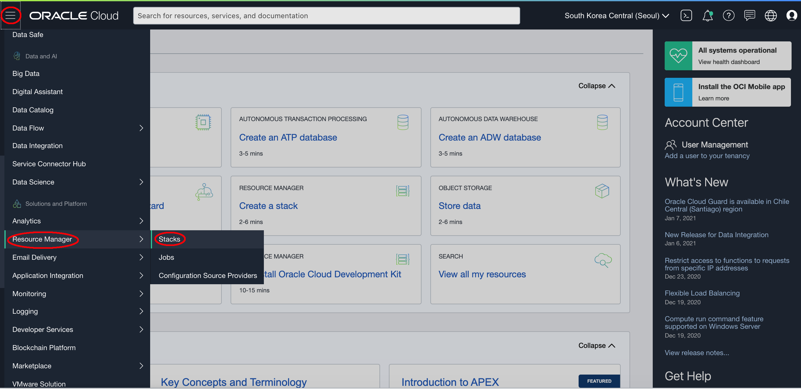
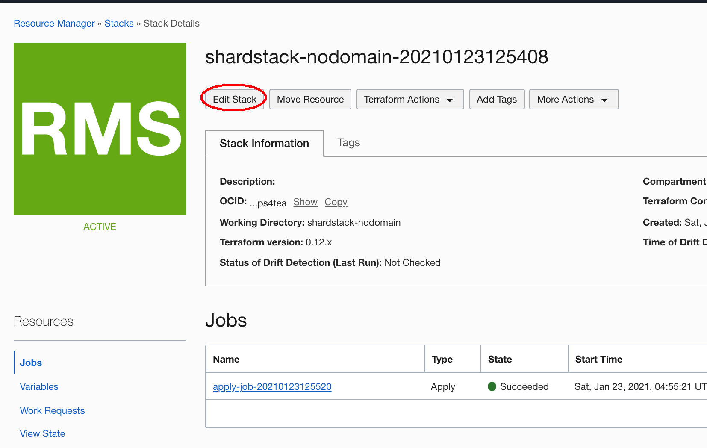
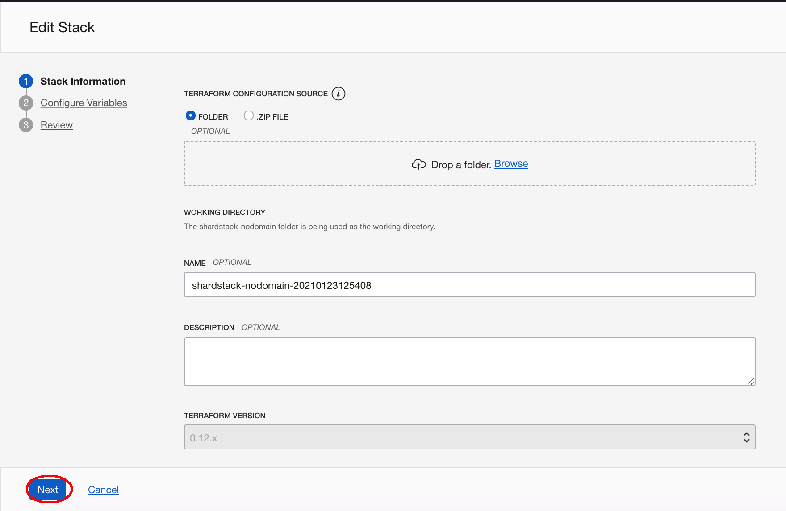
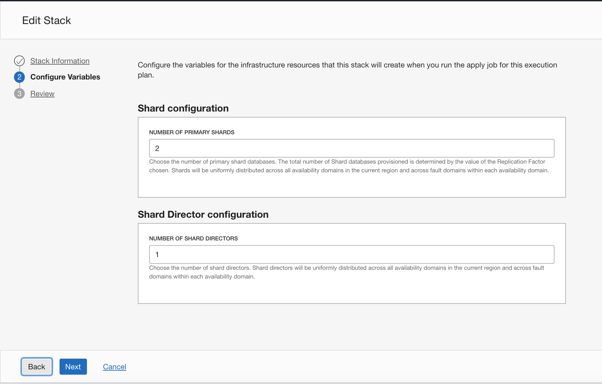
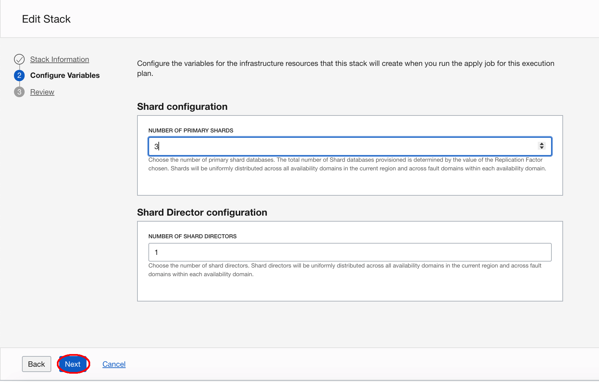
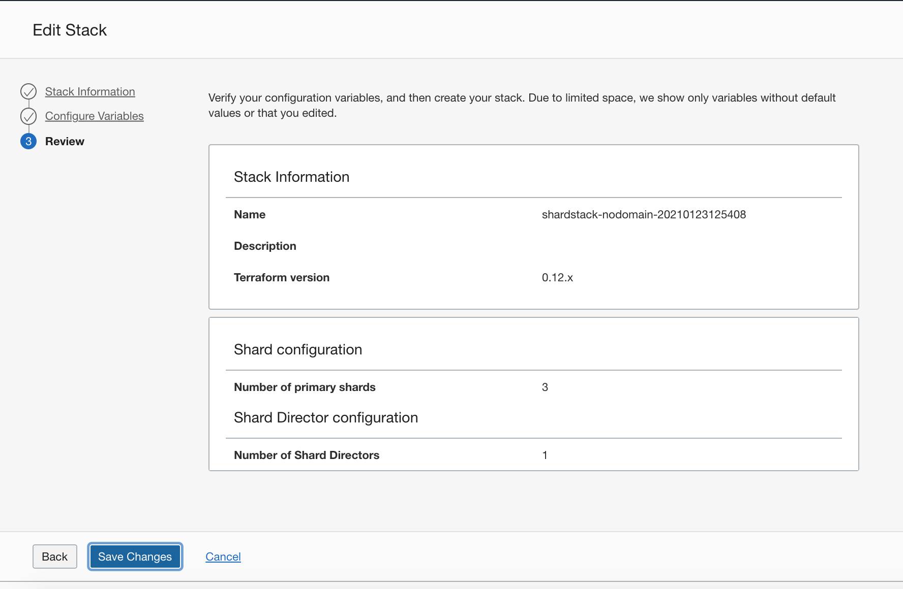
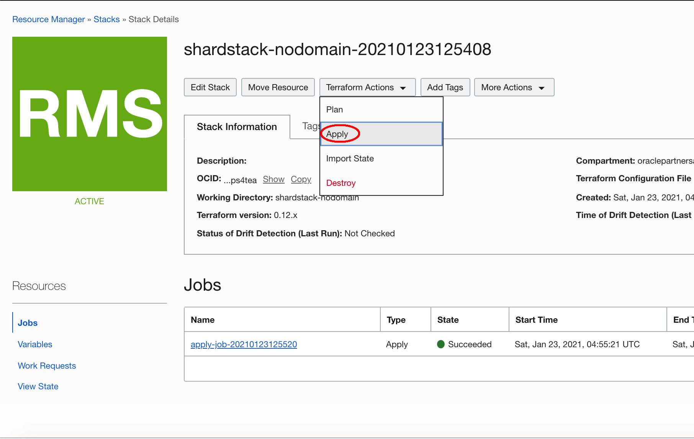
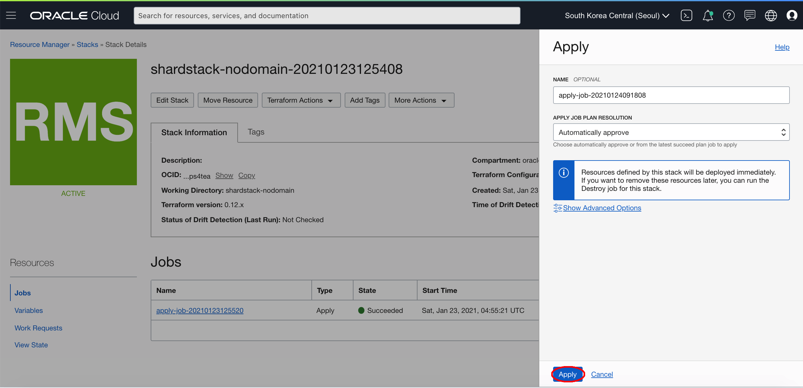
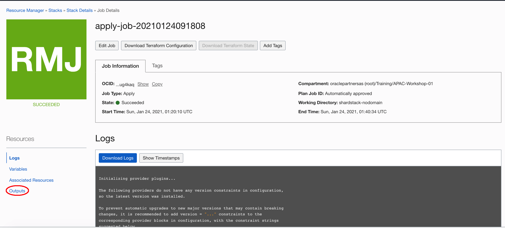
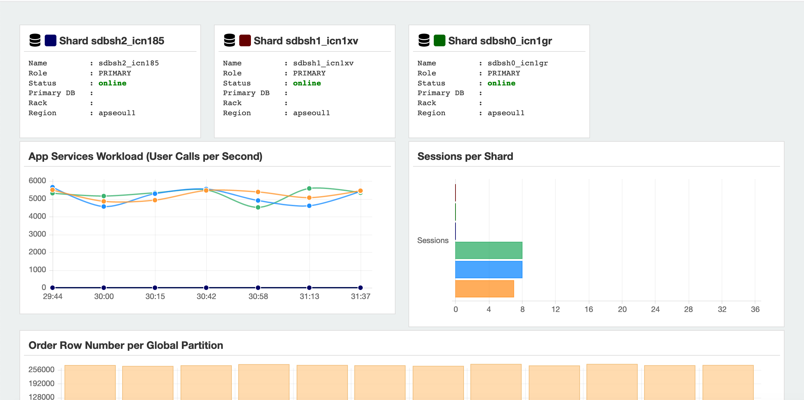

# Shard Database Scaling

## Introduction

You can scale the shard database with no impact to the application and with zero downtime.

Estimated Lab Time: 45 minutes.

### Objectives

In this lab, you will perform the following steps:
- Scale the shard database.
-  Verify the New Shard.
- Run the demo application again

### Prerequisites

This lab assumes you have already completed the following:
- Sharded database deployment
- Create the app schema
- Deploy the demo applications

## **Step 1:** Scale the shard database

1. From the OCI console, click on the left hamburger navigation Menu. Choose **Resource Manager** under **Solutions and Marketplace**.

   
   
2. Select the stack that you created in the previous lab.

   

3. Click on **Edit Stack**.

   

4. Click **Next**.

   

5. There are two variables that can be modified in the stack: Number of the shard database and number of the shard director.

   

6. Shard database and shard director can be scaled in (increased) or out (decreased) based on user requirements without affecting the application. In this workshop, we will only increase the number of the shard database. Modify the number of the shard database to 3 and click **Next**.

   

7. Review the changed variables and click **Save Changes**.

   

8. Click on **Terraform Actions**, then click **Apply**.

   

9. Accept the default values and click **Apply** in the pop up window.

   

10. The Job is running.

   

11. Wait about 20 minutes, the shard scaling job will complete, click **Output** 

    
    
12. You can found the third shard database was added, and the public ip is in the output page.

    

    

## **Step 2:** Verify the New Shard.

1. Connect to the shard director host, Run the GDSCTL command.

   ```
   $ gdsctl
   GDSCTL: Version 19.0.0.0.0 - Production on Sun Jan 24 01:42:55 GMT 2021
   
   Copyright (c) 2011, 2019, Oracle.  All rights reserved.
   
   Welcome to GDSCTL, type "help" for information.
   
   Current GSM is set to SDBSD0
   GDSCTL> 
   ```

   

2. Observe the newly added shard.

   ```
   GDSCTL> <copy>config shard</copy>
   Catalog connection is established
   Name                Shard Group         Status    State       Region    Availability 
   ----                -----------         ------    -----       ------    ------------ 
   sdbsh0_icn1gr_sdbpd shardgroup0         Ok        Deployed    apseoul1  ONLINE       
   b                                                                                    
   sdbsh1_icn1xv_sdbpd shardgroup0         Ok        Deployed    apseoul1  ONLINE       
   b                                                                                    
   sdbsh2_icn185_sdbpd shardgroup0         Ok        Deployed    apseoul1  ONLINE       
   b                                                                                    
   
   GDSCTL> 
   ```

   

3. Run the following command every minute or two to see the progress of automatic rebalancing of chunks. You can see there are 4 chunks that need to move to the third shard.

   ```
   GDSCTL> <copy>config chunks -show_reshard</copy>
   Chunks
   ------------------------
   Database                      From      To        
   --------                      ----      --        
   sdbsh0_icn1gr_sdbpdb          1         5         
   sdbsh1_icn1xv_sdbpdb          7         12        
   sdbsh2_icn185_sdbpdb          6         6         
   
   Ongoing chunk movement
   ------------------------
   Chunk     Source                        Target                        status    
   -----     ------                        ------                        ------    
   5         sdbsh0_icn1gr_sdbpdb          sdbsh2_icn185_sdbpdb          scheduled 
   6         sdbsh0_icn1gr_sdbpdb          sdbsh2_icn185_sdbpdb          Running   
   11        sdbsh1_icn1xv_sdbpdb          sdbsh2_icn185_sdbpdb          scheduled 
   12        sdbsh1_icn1xv_sdbpdb          sdbsh2_icn185_sdbpdb          scheduled 
   
   GDSCTL> 
   ```

   

4. If you encounter some issues, the chunk movement status is **Suspended**. You can run the following command to resume the chunk movement.

   ```
   GDSCTL> alter move -resume -chunk all -shard sdbsh0_icn1gr_sdbpdb,sdbsh1_icn1xv_sdbpdb,sdbsh2_icn185_sdbpdb
   ```

   

5. Observe that the chunks are automatically rebalanced upon the addition of new shard.

   ```
   GDSCTL> <copy>config chunks -show_reshard</copy>
   Chunks
   ------------------------
   Database                      From      To        
   --------                      ----      --        
   sdbsh0_icn1gr_sdbpdb          1         4         
   sdbsh1_icn1xv_sdbpdb          7         10        
   sdbsh2_icn185_sdbpdb          5         6         
   sdbsh2_icn185_sdbpdb          11        12        
   
   Ongoing chunk movement
   ------------------------
   Chunk     Source                        Target                        status    
   -----     ------                        ------                        ------    
   
   GDSCTL> 
   ```

   

6. Observe that the “databases” are automatically registered.

   ```
   GDSCTL> <copy>databases</copy>
   Database: "sdbsh0_icn1gr_sdbpdb" Registered: Y State: Ok ONS: N. Role: PRIMARY Instances: 1 Region: apseoul1
      Service: "oltp_rw_srvc" Globally started: Y Started: Y
               Scan: N Enabled: Y Preferred: Y
      Registered instances:
        sdb%1
   Database: "sdbsh1_icn1xv_sdbpdb" Registered: Y State: Ok ONS: N. Role: PRIMARY Instances: 1 Region: apseoul1
      Service: "oltp_rw_srvc" Globally started: Y Started: Y
               Scan: N Enabled: Y Preferred: Y
      Registered instances:
        sdb%11
   Database: "sdbsh2_icn185_sdbpdb" Registered: Y State: Ok ONS: N. Role: PRIMARY Instances: 1 Region: apseoul1
      Service: "oltp_rw_srvc" Globally started: Y Started: Y
               Scan: N Enabled: Y Preferred: Y
      Registered instances:
        sdb%21
   
   GDSCTL> 
   ```

   

7. Observe that the “services” are automatically brought up on the newly added shard.

   ```
   GDSCTL> services
   Service "oltp_rw_srvc.sdb.oradbcloud" has 3 instance(s). Affinity: ANYWHERE
      Instance "sdb%1", name: "sdbsh0", db: "sdbsh0_icn1gr_sdbpdb", region: "apseoul1", status: ready.
      Instance "sdb%11", name: "sdbsh1", db: "sdbsh1_icn1xv_sdbpdb", region: "apseoul1", status: ready.
      Instance "sdb%21", name: "sdbsh2", db: "sdbsh2_icn185_sdbpdb", region: "apseoul1", status: ready.
   
   GDSCTL> 
   ```

8. Exit GDSCTL.

   ```
   GDSCTL> exit
   [oracle@sdbsd0 ~]$
   ```

   

## **Step 3:** Run the Demo Application

2. Connect to the catalog database as sysdba with sqlplus. Using your own sys user password.

   ```
   [oracle@sdbsd0 ~]$ <copy>sqlplus sys/sdwAf1Z82_wX5M_vm_0@sdbsc0:1521/sdbpdb as sysdba</copy>
   
   SQL*Plus: Release 19.0.0.0.0 - Production on Sun Jan 24 02:11:27 2021
   Version 19.3.0.0.0
   
   Copyright (c) 1982, 2019, Oracle.  All rights reserved.
   
   
   Connected to:
   Oracle Database 19c EE Extreme Perf Release 19.0.0.0.0 - Production
   Version 19.9.0.0.0
   
   SQL> 
   ```
   
   
   
3. Manually update the monitored shard list. The package `dbms_global_views` is used by the monitor tools to monitor the status of shards. It will create a public `shard_dblinks_view` and a public dblink to each shard. If you skip this step, the monitor tools will not show the status of the latest added shard database. 

   ```
   SQL> <copy>exec dbms_global_views.create_all_database_links();</copy>
   
   PL/SQL procedure successfully completed.
   
   SQL> 
   ```
   
   
   
4. Exit the sqlplus.

   ```
   SQL> <copy>exit</copy>
   Disconnected from Oracle Database 19c EE Extreme Perf Release 19.0.0.0.0 - Production
   Version 19.9.0.0.0
   [oracle@sdbsd0 ~]$ 
   ```

   

5. Change the directory to `sdb_demo_app`. 

   ```
   [oracle@sdbsd0 ~]$ <copy>cd sdb_demo_app</copy>
   [oracle@sdbsd0 sdb_demo_app]$ 
   ```

   

6. Start the workload by executing command:

   ```
   [oracle@sdbsd0 sdb_demo_app]$ <copy>./run.sh demo</copy>
   ```

   

7. The result looks like the following. Wait several minutes, compare the APS values with the previous 2 sharded database. (Note: due to the application deployed in the shard director VM, choose a larger VM shape when in the setup shard environment to improve the performance)

   ```
   RO Queries | RW Queries | RO Failed  | RW Failed  | APS 
       1097487       208918            0            0         1724
       1100797       209543            0            0         1731
       1104116       210165            0            0         1745
       1107320       210790            0            0         1678
       1110452       211355            0            0         1597
       1113260       211893            0            0         1429
       1116142       212456            0            0         1495
       1118874       212974            0            0         1424
       1121014       213378            0            0         1086
       1123379       213869            0            0         1206
       1126113       214389            0            0         1396
       1128713       214877            0            0         1320
       1131355       215424            0            0         1384
       1134166       215867            0            0         1448
       1136353       216324            0            0         1131
   ```

   

8. Open another terminal, connect to the catalog host, switch to oracle user. Change the directory to `sdb_demo_app`.

   ```
   $ ssh -i labkey opc@xxx.xxx.xxx.xxx
   Last login: Mon Nov 30 06:07:40 2020 from 202.45.129.206
   -bash: warning: setlocale: LC_CTYPE: cannot change locale (UTF-8): No such file or directory
   
   [opc@sdbsd0 ~]$ sudo su - oracle
   Last login: Mon Nov 30 06:08:03 GMT 2020 on pts/0
   
   [oracle@sdbsd0 ~]$ cd ~/sdb_demo_app
   [oracle@sdbsd0 sdb_demo_app]$
   ```

   

9. Start the monitoring tool via the following command. (Note: due to the resource limit, start monitor may impact the application performance).

   ```
   [oracle@sdbsd0 sdb_demo_app]$ <copy>./run.sh monitor</copy>
   @oracle.monitor.Main.registerDatabase : INFO 2020-12-01T03:30:41.501 : Context : /db/demo/info
   @oracle.monitor.DatabaseMonitor$BackgroundStatusCheck.run : java.lang.ArrayIndexOutOfBoundsException : 3
   @oracle.monitor.DatabaseMonitor$BackgroundStatusCheck.run : java.lang.ArrayIndexOutOfBoundsException : 4
   @oracle.monitor.DatabaseMonitor$BackgroundStatusCheck.run : java.lang.ArrayIndexOutOfBoundsException : 5
   ```

   

10. From you laptop, launch a browser and use the URL: `http://xxx.xxx.xxx.xxx:8081`. Using the public ip address of the shard director host and the port number is 8081.

   

   

11. Scroll down the screen, you can see the Last inserted orders:

   

   

12. Press `Ctrl+C` to cancel the demo in both of the terminal.

